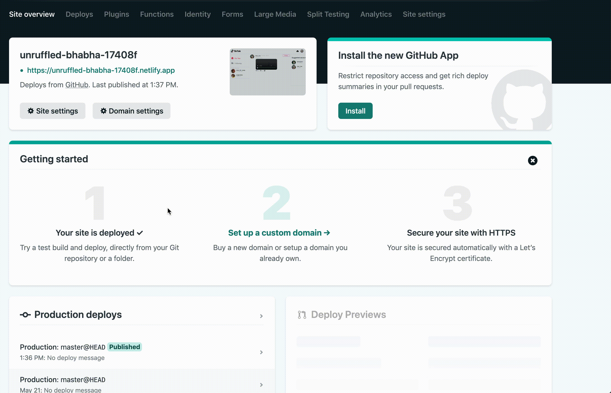

<!--- STARTEXCLUDE --->
# Astra DB TikTok Clone Workshop

[](https://gitpod.io/#https://github.com/DataStax-Academy/workshop-spring-data-cassandra) 
[](http://www.apache.org/licenses/LICENSE-2.0)
[](https://discord.com/widget?id=685554030159593522&theme=dark)

*50 minutes, Intermediate, [Start Building](#running-astra-tik-tok)*

A simple Tik-Tok clone running on Astra DB that leverages the Document API.
<!--- ENDEXCLUDE --->


## Objectives
* Deploy a TikTok clone "locally" and to production
* Learn how to use the @astrajs document API to quickly and easily interact with JSON documents
* Leverage Netlify and DataStax AstraDB

## ℹ️ Frequently asked questions ℹ️ 

- *Can I run the workshop on my computer?*
> There is nothing preventing you from running the workshop on your own machine. 
> If you do so, you will need
> * git installed on your local system
> * [node 15 and npm 7 or later](https://www.whitesourcesoftware.com/free-developer-tools/blog/update-node-js/)
>
> You will have to adapt commands and paths based on your environment and install the dependencies by yourself. **We won't provide support** to keep on track with schedule. However, we will do our best to give you the info you need to be successful.

- *What other prerequisites are there?*
> * You will need a github account
> * You will also need Netlify and Astra DB accounts, but we'll work through that in the exercises
> * Use **Chrome** or **Firefox** for the best experience. Other browsers are great, but don't work well with the GitPod integration we use a bit later.

- *Do I need to pay for anything for this workshop?*
> * No. All tools and services we provide here are FREE.

## Materials for the Session

It doesn't matter if you join our workshop live or you prefer to do at your own pace, we have you covered. In this repository, you'll find everything you need for this workshop:

- [Slide deck](./slides/slides.pdf)
- [Discord chat](https://bit.ly/cassandra-workshop)
- [Questions and Answers](https://community.datastax.com/)

## Homework


Don't forget to complete your upgrade and get your verified skill badge! Finish and submit your homework!

1. Complete the practice steps from this repository as described below. Make screenshots alongside the steps and show us your deployed production TikTok clone up in Netlify.
2. (Optional extra credit) Watch the 2 hour Ania video [HERE](#video-tutorial-with-ania-kubow), build the app yourself, and show us the completed app.
3. Submit your homework [here](https://github.com/datastaxdevs/workshop-astra-tik-tok/issues/new?assignees=HadesArchitect&labels=homework%2Cpending&template=homework-assignment.md&title=%5BHW%5D+%3CNAME%3E)

That's it, you are done! Expect an email next week!
  
# Let's start

## Table of contents

### Part I - Run and Deploy
1. [Create Astra DB Instance](#1-login-or-register-to-astra-db-and-create-database)
2. [Deploy to Netlify](#2-deploy-to-netlify)
3. [Access YOUR GitHub repository](#3-access-your-github-repository)
4. [Launch GitPod](#4-launch-gitpod-ide)
5. [Install the Netlify CLI](#5-install-the-netlify-cli-command-line-interface)
6. [Generate application token to securely connect to the database](#6-generate-application-token-to-securely-connect-to-the-database)
7. [Configure and connect database](#7-configure-and-connect-database)
8. [Launch your app](#8-launch-your-app)
9. [Connect Netlify to your site](#9-connect-netlify-to-your-site)
10. [Deploy to production](#10-deploy-to-production)

### Part 2 - Working with Astra DB and the document API
11. [Connecting the Database](#11-connecting-the-database)

### Part 3 - Serverless Functions, how they work
12. [Create](#12-create)
13. [Update](#13-update)
14. [Find](#14-find)
15. [Serverless configuration](#15-serverless-configuration)

### Extra resources
[What is JamStack?](jamstack.md)

[Video tutorial with Ania Kubow](#video-tutorial-with-ania-kubow)

# Part 1 - Run and Deploy

### 1. Login or Register to Astra DB and create database

Click the button to login or register with Datastax

<a href="https://dtsx.io/AstraDB-714"></a>
- <details><summary>Show me!</summary>
    
</details>

**Use the following values when creating the database**
|Field| Value|
|---|---|
|**database name**| `tiktok_workshop_db` |
|**keypace**| `tiktok_keyspace` |
|**Cloud Provider**| *Use the one you like, click a cloud provider logo,  pick an Area in the list and finally pick a region.* |

### 2. Deploy to Netlify
- <details><summary> What does the netlify deploy button do?</summary>The Netlify deploy button will:<ul>
    <li>Create a new repository for you on Github</li>
    <li>Create a site on Netlify</li>
    <li>Link the two together.</li></ul>
</details>

- Click the button to deploy

  [](https://app.netlify.com/start/deploy?repository=https://github.com/datastaxdevs/workshop-astra-tik-tok)
 * <details><summary>Show me!</summary>
    
    </details>

This will take a few minutes.

  * Click on `Site deploy in progress` within the Netlify UI, 
    <details>
    <summary>Show me! </summary>
    
    </details>

  * Click the top deploy link to see the build process.
    <details>
    <summary>Show me! </summary>
    
    </details>

  * Wait until the build complete `Netlify Build Complete`,  **When you see Pushing to repository** you're ready to move on.
    <details>
    <summary>Show me! </summary>
    
    </details>

  * Scroll up to the top and click on the site name (it'll be after {yourlogin}'s Team next to the Netlify button).
    <details>
    <summary>Show me! </summary>
    
    </details>

### 3. Access YOUR GitHub repository

  * Click on the `GitHub` in `Deploys from GitHub` to get back to your new repository.  Scroll to where you were in the README.
    <details>
    <summary>Show me! </summary>
    
    </details>

### 4. Launch GitPod IDE
- Click the button to launch the GitPod IDE from **YOUR** repository.

* _Supported by  Chrome and  Firefox_

#### WAIT! Before moving on ensure you are working out of YOUR repository, not the datastaxdevs repository.


If you are still using the `datastaxdevs` repo please ensure to follow the previous step, [step3](#3-clone-your-github-repository) to get to your repo.

 * Ok, I've got it, just give me the button already
 * <details>
     <summary>CLICK HERE to launch GitPod</summary>

     [](https://gitpod.io/from-referrer/)
   </details>
   
#### WAIT! Before moving on ensure you are working out of YOUR repository, not the datastaxdevs repository.
* From your GitPod terminal execute the following command
```
git remote -v
```

If the result returned from the command displays **`datastaxdevs`** then you are not in the correct repository. If this is the case please [repeat step 3 above](#3-access-your-github-repository), otherwise just move on to the next step.

### 5. Install the Netlify CLI (Command Line Interface)
 * In the `workshop-astra-tik-tok` directory run the following command to install the netlify-cli
 ```
 npm install -g netlify-cli
```
 * <details><summary>Show me!</summary>
    
    </details>

### 6. Generate application token to securely connect to the database

Following the [Documentation](https://docs.datastax.com/en/astra/docs/manage-application-tokens.html) create a token with `Database Admnistrator` roles.

- Go the `Organization Settings`

- Go to `Token Management`

- Pick the role `Database Admnistrator` on the select box

- Click Generate token

 * <details><summary>Show me!</summary>
    
    </details>

This is what the token page looks like. 
 * Click the **`Download CSV`** button. You are going to need these values here in a moment.


Notice the clipboard icon at the end of each value.

- `Client ID:` We will *not* use this during this workshop

- `Client Secret:` We will *not* use this during this workshop

- `Token:` *This is your token!* We will use it as a api Key to interact with APIS

To know more about roles of each token you can have a look to [this video.](https://www.youtube.com/watch?v=nRqu44W-bMU)

### 7. Configure and connect database
 * In the repository directory run the following command to set up your Astra DB environment. This will verify the database you created earlier or create a new one for you if it can't find your database.
 ```
 npm exec astra-setup tiktok_workshop_db tiktok_keyspace
```

<details>
<summary>What does astra-setup do?</summary>
    To setup your ASTRA instance, you want to run `npm exec astra-setup`

    This will do the following:
    * Have you go to your [Astra DB instance](https://datastx.io/workshops) to register or login. There is no credit card required to sign up. The 'Pay as you go' option gives you a huge amount of transactions for free:
        * 30 million reads
        * 5 million writes
        * 40 gigabytes of storage
    * Give steps to grab a Database Administrator Token and paste it into the input field
    * Ask you what database you want to use (default, existing, create)
    * Create or access the database
    * Create/update an .env file in the project root
    * Create/update an .astrarc file in your home directory
        * This can be used by httpie-astra `pip3 install httpie-astra`
        * It can also be used by the @astra/collections and @astra/rest node modules

    ## Specify the database and keyspace
    You can run the script and tell it which database/keyspace to use by using:
    `npm exec astra-setup databasename keyspacename`
</details>

### 8. Launch your app
  * Run the application 
  ```
  netlify dev
  ```
  * The application should automatically launch in the GitPod preview pane

### 9. Connect Netlify to your site
Execute each of the commands below to link your code to your Netlify deployment.
  * First thing, we'll need to **STOP** the `netlify dev` command we issued a moment ago. In the terminal where you executed the netlify command issue a `CTRL-C` (control key + the C key) in order to stop the process.
  * Then continue with the following commands
  * This will pop up a browser to authenticate with netlify
  ```
  netlify login
  ```
  _Note, when using GitPod the preview pane will not display this properly. You must click the "open in a new window" button in the very top right of the preview pane._

  * This will link your workspace to the associated site
  ```
  netlify link
  ```

  * This will take the .env file created by astra-setup and upload it to netlify
  ```
  netlify env:import .env
  ```

<!--
  * Will be used to allow you to execute `netlify open`
  ```
  netlify sites:list
  ```
-->

### 10. Deploy to production
Now that you've hooked everything up, time to deplpoy to production.

  * Run
  ```
  netlify build
  ```

  * Then run
  ```
  netlify deploy --prod
  ```

  * Then finally run
  ```
  netlify open:site
  ```
  
  You've deployed your app to Netlify!
  

# Part 2 - Working with AstraDB and the document API

### 11. Connecting the Database

Let's briefly dive into the connection between our serverless functions and our Astra DB.
We are using the `@astrajs/collections` library to make the connection using the Document API provided by Stargate. To do so, we start by creating a 'client'. 

(See: `functions/utils/astraClient.js`)

``` javascript
const { createClient } = require("@astrajs/collections");

let astraClient = null;

const getAstraClient = async () => {
  if (astraClient === null) {
    astraClient = await createClient(
      {
        astraDatabaseId: process.env.ASTRA_DB_ID,
        astraDatabaseRegion: process.env.ASTRA_DB_REGION,
        applicationToken: process.env.ASTRA_DB_APPLICATION_TOKEN,
      },
      30000
    );
  }
  return astraClient;
};
```

Here we are defining a new method called `getAstraClient` that uses the `createClient` method from our `astrajs` library to create a connection to our database. We then provide it the needed database credentials we added to our environment varaiables earlier;

- `ASTRA_DB_ID`
- `ASTRA_DB_REGION`
- `ASTRA_DB_APPLICATION_TOKEN`

Then we return the `astraClient` we can then use in our API calls.

We also need to create a document collection to store our data.

``` javascript
const getCollection = async () => {
  const documentClient = await getAstraClient();
  return documentClient
    .namespace(process.env.ASTRA_DB_KEYSPACE)
    .collection("tktkposts");
};
```

In this method, we are using our previously created `getAstraClient` method to initialize the database connection, and then create a collection in the keyspace we defined in our environment variables;

- `ASTRA_DB_KEYSPACE`

We will call the collection "**tktkposts**".

So now, any time we want to perform operations on our data, we will reference this method `getCollection`, and use the Document API from Stargate to do so.

✅ Now that we have locally deployed our TikTok app, let's take a look at this in our database. Head to your [Astra DB dashboard](astra.datastax.com) and click the `Connect` button next to your database ('tiktok_workshop_db').


✅ Then scroll down to the section called 'Launching SwaggerUI' and click the link. We'll be using SwaggerUI to make api calls to our database and see the results.


✅ Open up the first section labelled "List collections in namespace" and click the button "Try it out".


✅ We need to provide our Application Token, and our keyspace name. Fortunately we have these already saved in our environment variables in the `.env` file. Go ahead and copy those over, then click 'Execute'.


And there we go, we see that a collection has been made in our database called "**tktkposts**"


<br/>

## Document API

For our TikTok app, we will not be dealing with the Document API directly. Instead `@astrajs/collections` does that for us, and provides us with easy to use methods.

If you want a comprehensive list of the capabilities of `@astrajs/collections`, check out this documentation: [AstraJS Collections](https://docs.datastax.com/en/astra/docs/astra-collection-client.html)

For now, let's go over the 3 methods we'll be using in this app:

- `create`
- `update`
- `find`

<br/>

### 12. Create

The `create` method is used when we want to add documents to our collection. For example, in **`functions/add.js`** we get our collection from the database using our `getCollection` method.

``` javascript
const users = await getCollection();
```

Then we use the `create` method to create a document, providing the collection id, and body of the document.

``` javascript
try {
    const user = await users.create(id, event.body);
    return {
      statusCode: 200,
      body: JSON.stringify(user),
    };
}
```

<br/>

### 13. Update

The `update` method is used to update portions of existing documents. Take a look at **`functions/edit.js`**. Again we use `getCollection()` to get our collection from the database, then we use the `update` method, provide it with an id for the document we want to edit, and the data that needs updating.

``` javascript
try {
    users.update(body.userId, body.data);
    return {
      statusCode: 200,
    };
  }
```

<br/>

### 14. Find

And finally the `find` method is used to retrieve documents. In **`functions/posts.js`** we are again using `getCollections()` and using the `find` method on the result.

``` javascript
try {
    const res = await users.find({});
    return {
      statusCode: 200,
      body: JSON.stringify(Object.keys(res).map((i) => res[i])),
    };
  }
```

In this case, we are passing an empty object to retrieve all documents. In a real-world scenario, we would pass a qualifier to get only the documents relevant to a specific user.

Let's go back to SwaggerUI and give this a test.

✅ Back in SwaggerUI, open up the section labelled "Search documents in a collection".


✅ Again, we have to provide the Application Token, keyspace name, and this time we will also include the collection id: **`tktkposts`**. We should also increase the page size as the tool defaults to only returning 1 document, and we will be retrieving many. Go ahead and fill those fields and click 'Execute'.


And we see all of the documents stored in our database.


# Part 3 - Serverless Functions, how they work
So how do these functions work with no back-end server?

The short answer is that Netlify is providing the back-end environment for us. All we have to do is tell Netlify where to find the functions. Netlify will do the rest.

### 15. Serverless configuration

Take a look at `netlify.toml`.

```
[build]
command = "npm run build"
functions = "functions"
publish = "build"
```

This is the configuration file we include in our codebase that tells Netlify how to build our app. In our case it's really simple. First we give the `build` command to build our app: `npm run build`. Then we tell Netlify where to find our serverless functions, and finally where to find the resulting app after build.

So Netlify will create endpoints for our serverless functions based on the files it finds in our functions folder.

For example, we have a function called `posts.js`. As we saw before, this function returns all of the current posts in our database. Netlify will see that file in our `functions` directory and dynamically create an endpoint at `/.netlify/functions/posts`.

✅ We can see these functions in our Netlify account.
- Go to netlify.com and sign in.
- Select your site from the list.
- Select the "Functions" tab at the top.



From here we can see all our functions and get direct links as well as watch real time logs.

We can also see this in action by manually going to the endpoint on our Netlify site: `[your-site-url]/.netlify/functions/posts`.


# Extra resources

## Video tutorial with Ania Kubow
Thank you to our wonderful friend Ania Kubow for producing the TikTok clone. If you are not aware of Ania and love learning about coding you should absolutely check out her YouTube channel listed below.

While we focused on getting you up and running to production with Astra DB and Netlify, Ania's video will dig into more details on the app itself. Check it out to dig in more.

<!--- STARTEXCLUDE --->
## Running Astra DB Tik-Tok
We're using Create-React-App and the Astra DB Document API to create a simple Tik-Tok clone.  Follow along in this video tutorial: [https://youtu.be/IATOicvih5A](https://youtu.be/IATOicvih5A).

Follow the instructions below to get started.

### Video Content:
- [https://youtu.be/IATOicvih5A](https://youtu.be/IATOicvih5A)
- (00:00) Introduction
- (03:05) Creating our Database on DataStax
- (06:52) Setting up our App
- (12:37) Routing Pages
- (18:02) Creating Components
- (28:32) Introduction to Data with Netlify and Stargate
- (30:10) Introduction to using the astrajs/collections
- (34:01) Posting data to our Database (creating dummy Tik Tok posts)
- (34:01) Adding authorization to access our Database
- (43:10) Getting data from our Database (getting all our Tik Tok posts)
- (50: 32) Viewing all our Data
- (51:56) Rendering components based on our Data
- (01:17:01) Editing our Data (following/unfollowing a user)
- (01:32:57) Adding new Data to our Database (creating a Tik Tok post)

### If you did like this video, please hit the Like and Subscribe button so I know to make more!
- Twitter: https://twitter.com/ania_kubow
- YouTube: https://youtube.com/aniakubow
- Instagram: https://instagram.com/aniakubow
<!--- ENDEXCLUDE --->
